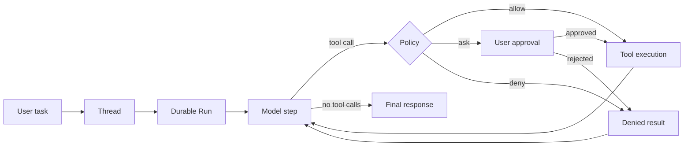

# NexaPilot

[English](README.md) · [简体中文](README.zh-CN.md)


NexaPilot is a local-first personal-agent runtime with durable execution, permission-aware tools, long-term memory, subagents, and OpenAI-compatible model access. The product is presented to users simply as **Nexa**.

It provides a Web console, CLI, and REST API around one persistent agent runtime. A task can stream model output, request approval, execute tools, survive process interruptions, delegate focused work, and preserve an auditable result in SQLite.

> NexaPilot is under active development and currently targets a trusted local operator. Review the permission model before using it with sensitive files or accounts.

## Why NexaPilot

- **Workspace-native work** — every project has an explicit local root and every tool runs against a controlled working directory.
- **Durable agent runs** — runs, steps, messages, parts, tool operations, and provider attempts are persisted instead of living only in browser state.
- **Visible control flow** — reasoning summaries, tool input/output, approvals, artifacts, and final responses form one inspectable timeline.
- **Policy-aware tools** — `allow`, `ask`, and `deny` rules separate system policy from a user's approval decision.
- **Extensible runtime** — built-in tools, MCP servers, Skills, subagents, scheduled tasks, and optional integrations share one execution model.
- **Measured quality** — dataset-driven evaluation can check answers, files, commands, tool behavior, budgets, and regressions.

## Quick start

Requirements: Python 3.11+ and [uv](https://docs.astral.sh/uv/).

```bash
git clone https://github.com/oombot2049/nexapilot.git
cd nexapilot
uv sync
mkdir .nexa
cp config.yaml.example .nexa/config.yaml
```

On PowerShell, replace the last two commands with:

```powershell
New-Item -ItemType Directory -Force .nexa
Copy-Item config.yaml.example .nexa/config.yaml
```

Edit `.nexa/config.yaml`, set an OpenAI-compatible endpoint, API key, model, and transport, then start the console:

```bash
uv run nexa serve --port 4096
```

Open [http://127.0.0.1:4096](http://127.0.0.1:4096), add a local folder as a project, create a thread, and send a task.

```bash
# Verify configuration, storage, provider, MCP, Skills, and runtime health
uv run nexa doctor

# Run one task without opening the console
uv run nexa run "Summarize this workspace" --permission ask
```

See [Installation](docs/getting-started/installation.md), [Configuration](docs/getting-started/configuration.md), and [First agent run](docs/getting-started/first-agent-run.md) for the complete path.

## How a run works



The loop reloads persisted history after tool execution. Tool results, denials, retries, and final output therefore remain part of one recoverable conversation instead of transient UI events.

## Architecture at a glance

```text
Web Console / CLI / REST API
             │
      Application services
             │
  Session loop · Run lifecycle
             │
Context · Provider · Tools · Agents
             │
 SQLite · Outbox · Event projections
```

Read the [architecture overview](docs/architecture/overview.md) or start with these concepts:

- [Projects, threads, and runs](docs/concepts/projects-threads-runs.md)
- [Tools, policy, and permission](docs/concepts/tools-policy-permission.md)
- [Memory and context](docs/concepts/memory-and-context.md)

## Documentation

| I want to… | Start here |
| --- | --- |
| Install and run NexaPilot | [Getting started](docs/getting-started/installation.md) |
| Understand the product model | [Concepts](docs/README.md#concepts) |
| Configure and operate a feature | [Guides](docs/README.md#guides) |
| Study the internals | [Architecture](docs/README.md#architecture) |
| Look up an exact contract | [Reference](docs/README.md#reference) |
| Read in Chinese | [中文文档](docs/zh-CN/README.md) |

## Development

```bash
uv run pytest
```

Executable evaluation datasets live under [`docs/examples`](docs/examples/README.md). Source code, configuration parsing, API schemas, and tests are the final source of truth.

NexaPilot does not currently provide a hosted multi-tenant control plane. Daytona, Feishu, Langfuse, Tavily, external knowledge bases, and MCP servers are optional integrations.

## License

NexaPilot is available under the [ISC License](LICENSE).
