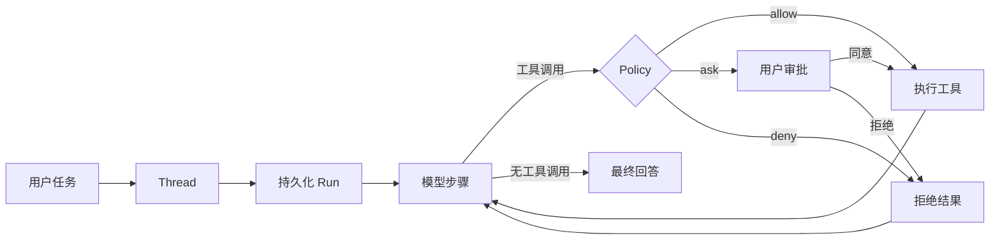

# NexaPilot

[English](README.md) · [简体中文](README.zh-CN.md)

NexaPilot 是一个本地优先的个人 Agent Runtime，提供可恢复执行、权限工具、长期记忆、Subagent 和 OpenAI-compatible 模型接入；面向用户时简称 **Nexa**。

它通过 Web 控制台、CLI 和 REST API 暴露同一个持久化 Agent Runtime。一次任务可以持续输出模型响应、发起权限审批、执行工具、从进程中断中恢复、委派子任务，并将可审计结果保存到 SQLite。

> NexaPilot 仍处于活跃开发阶段，目前主要面向可信任的本地操作者。将其用于敏感文件或账号前，请先理解权限模型。

## 为什么选择 NexaPilot

- **围绕本地 Workspace 工作**：每个 Project 都有明确的目录根边界，工具在受控工作目录中执行。
- **Run 可持久化**：Run、Step、Message、Part、工具操作和 Provider 尝试不会只存在于浏览器状态。
- **执行过程可见**：思考摘要、工具输入输出、审批、Artifact 和最终回答形成统一时间线。
- **工具受策略约束**：`allow`、`ask`、`deny` 将系统策略与用户审批决定分开。
- **扩展方式统一**：内置工具、MCP、Skills、Subagent、定时任务和可选集成都进入同一执行模型。
- **质量可评估**：基于 Dataset 检查回答、文件、命令、工具行为、预算和回归。

## 快速开始

需要 Python 3.11+ 和 [uv](https://docs.astral.sh/uv/)。

```bash
git clone https://github.com/oombot2049/nexapilot.git
cd nexapilot
uv sync
mkdir .nexa
cp config.yaml.example .nexa/config.yaml
```

PowerShell 使用：

```powershell
New-Item -ItemType Directory -Force .nexa
Copy-Item config.yaml.example .nexa/config.yaml
```

编辑 `.nexa/config.yaml`，配置 OpenAI-compatible 服务地址、API Key、模型和 Transport，然后启动控制台：

```bash
uv run nexa serve --port 4096
```

打开 [http://127.0.0.1:4096](http://127.0.0.1:4096)，添加一个本地文件夹作为 Project，创建 Thread，然后发送任务。

```bash
uv run nexa doctor
uv run nexa run "总结这个工作目录" --permission ask
```

完整过程参见[安装](docs/zh-CN/getting-started/installation.md)、[配置](docs/zh-CN/getting-started/configuration.md)和[第一次 Agent Run](docs/zh-CN/getting-started/first-agent-run.md)。

## 一次 Run 如何执行



每次工具执行后，Agent Loop 都会重新加载持久化历史。因此工具结果、审批拒绝、重试和最终回答属于同一次可恢复对话，而不是临时的界面事件。

## 架构概览

```text
Web Console / CLI / REST API
             │
          应用服务层
             │
    Session Loop · Run 生命周期
             │
Context · Provider · Tools · Agents
             │
 SQLite · Outbox · Event Projection
```

继续阅读[架构概览](docs/zh-CN/architecture/overview.md)，或先理解：

- [Project、Thread 与 Run](docs/zh-CN/concepts/projects-threads-runs.md)
- [Tool、Policy 与 Permission](docs/zh-CN/concepts/tools-policy-permission.md)
- [Memory 与 Context](docs/zh-CN/concepts/memory-and-context.md)

## 文档导航

| 我想要…… | 从这里开始 |
| --- | --- |
| 安装并启动 NexaPilot | [快速开始](docs/zh-CN/getting-started/installation.md) |
| 理解产品概念 | [核心概念](docs/zh-CN/README.md#核心概念) |
| 配置和使用某项能力 | [使用指南](docs/zh-CN/README.md#使用指南) |
| 研究内部实现 | [架构设计](docs/zh-CN/README.md#架构设计) |
| 查询准确契约 | [参考手册](docs/zh-CN/README.md#参考手册) |

## 开发

```bash
uv run pytest
```

可执行评估数据位于 [`docs/examples`](docs/examples/README.md)。源码、配置解析、API Schema 和自动化测试是最终事实来源。

NexaPilot 当前不包含托管式多租户控制面。Daytona、飞书、Langfuse、Tavily、外部知识库和 MCP Server 都是可选集成。

## 开源许可证

NexaPilot 使用 [ISC License](LICENSE) 开源。
