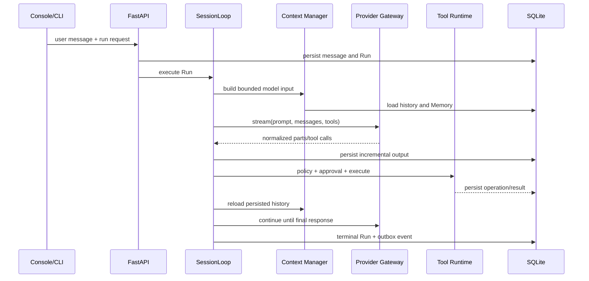

# Architecture overview

[Documentation](../README.md) · [中文](../zh-CN/architecture/overview.md)

NexaPilot is a modular monolith: one Python service owns HTTP, the Agent Loop, persistence, tools, background workers, and the static Web console. Boundaries are explicit so individual adapters can evolve without requiring distributed deployment.

## Layers

```text
Interfaces
  Web console · CLI · REST API · Feishu channel · Cron wake-up
                         │
Application
  Session/Run services · AgentService · PermissionService
                         │
Runtime
  SessionLoop · Context Manager · Provider Gateway · Tool Registry
                         │
Domain and projections
  Projects · Sessions · Runs · Messages · Memory · Tasks · Artifacts
                         │
Infrastructure
  SQLite · Transactional Outbox · Event Bus · MCP · optional adapters
```

## Core principles

1. **SQLite is the local fact store.** The UI is a projection and can reload after refresh.
2. **A Run is durable.** State transitions, heartbeats, steps, operations, provider attempts, and artifacts are persisted.
3. **The model proposes; code decides.** Tool schemas constrain arguments, Policy decides allow/ask/deny, and executors enforce runtime limits.
4. **Protocols stop at adapters.** Chat Completions and Responses events become one internal provider protocol before reaching the loop.
5. **Derived data keeps provenance.** Memory and UI projections retain source identifiers and can be rebuilt.

## One request across the system



## Source map

| Area | Source |
| --- | --- |
| API and composition root | `src/nexapilot/api/app.py` |
| Agent Loop | `src/nexapilot/loop/session_loop.py` |
| Provider Gateway | `src/nexapilot/llm/` |
| Tools and Policy | `src/nexapilot/tools/`, `src/nexapilot/permission/` |
| Agents and child workspaces | `src/nexapilot/agents/` |
| Memory and context | `src/nexapilot/memory/` |
| Persistence | `src/nexapilot/store/sqlite.py` |
| Outbox worker | `src/nexapilot/outbox/worker.py` |
| CLI and Web | `src/nexapilot/cli/`, `src/nexapilot/web/` |

The current deployment boundary is a trusted local process. A future hosted control plane would require authentication, tenant isolation, remote object storage, quotas, audit retention, and a different secret model; those are not implied by this architecture.
