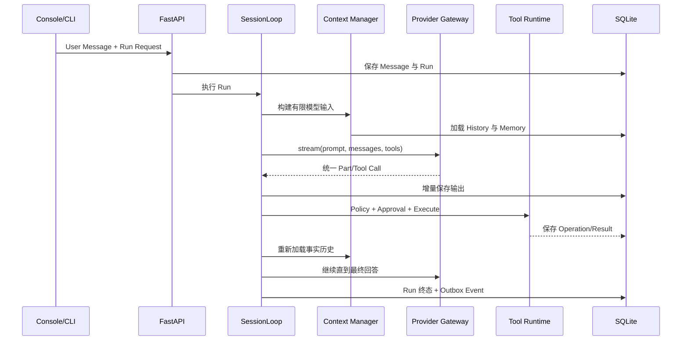

# 架构概览

[中文文档](../README.md) · [English](../../architecture/overview.md)

NexaPilot 是模块化单体：一个 Python 服务承载 HTTP、Agent Loop、持久化、工具、后台 Worker 和静态 Web 控制台。模块边界保持明确，使各 Adapter 可以独立演进，而不要求分布式部署。

## 分层

```text
Interface
  Web Console · CLI · REST API · 飞书 Channel · Cron Wake-up
                         │
Application
  Session/Run Service · AgentService · PermissionService
                         │
Runtime
  SessionLoop · Context Manager · Provider Gateway · Tool Registry
                         │
Domain 与 Projection
  Projects · Sessions · Runs · Messages · Memory · Tasks · Artifacts
                         │
Infrastructure
  SQLite · Transactional Outbox · Event Bus · MCP · 可选 Adapter
```

## 核心原则

1. **SQLite 是本地事实库**：界面只是 Projection，可以在刷新后重建。
2. **Run 可持久化**：状态流转、心跳、Step、Operation、Provider Attempt 和 Artifact 均落库。
3. **模型提议、代码决策**：Schema 约束参数，Policy 决定 allow/ask/deny，Executor 执行运行限制。
4. **协议终止于 Adapter**：Chat Completions 和 Responses 事件先转为统一内部协议。
5. **派生数据保留来源**：Memory 和 UI Projection 保存 Source ID，可以重建。

## 一次请求穿过系统



## 源码地图

| 区域 | 源码 |
| --- | --- |
| API 与 Composition Root | `src/nexapilot/api/app.py` |
| Agent Loop | `src/nexapilot/loop/session_loop.py` |
| Provider Gateway | `src/nexapilot/llm/` |
| Tool 与 Policy | `src/nexapilot/tools/`、`src/nexapilot/permission/` |
| Agent 与 Child Workspace | `src/nexapilot/agents/` |
| Memory 与 Context | `src/nexapilot/memory/` |
| 持久化 | `src/nexapilot/store/sqlite.py` |
| Outbox Worker | `src/nexapilot/outbox/worker.py` |
| CLI 与 Web | `src/nexapilot/cli/`、`src/nexapilot/web/` |

当前部署边界是可信本地进程。托管控制面还需要鉴权、租户隔离、远端对象存储、Quota、审计保留和新的 Secret 模型，当前架构不暗示这些能力已经存在。
